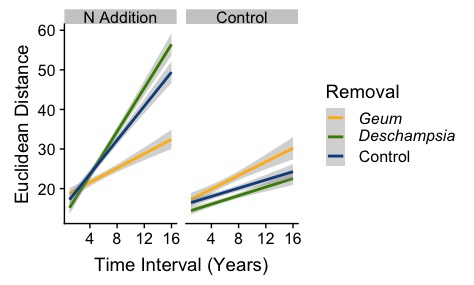

# Nitrogen Deposition in the Front Range, Colorado

## Biological Question
How does removal of a dominant species alter community response to nitrogen addition?

## Introduction
Communities across the globe are experiencing ecological presses, such as nitrogen (N) deposition (Vitousek et al. 1997; Dentener et al. 2006), that are causing shifts in community structure and function (Collins et al., 1998; Suding et al., 2008). Community response to N deposition may be mediated by the response of the dominant species; dominant species have a disproportionate influence on the community through species interactions and control over nutrient dynamics (Hillebrand 2008).

## Methods
### The source of the data:
The data that I analyzed comes from a long-term N addition experiment at Niwot Ridge on the Front Range of Colorado. The study was initiated by Katie Suding in 2002 as the effects of N deposition in alpine ecosystems were becoming apparent. The study system, moist meadow communities at Niwot Ridge, is co-dominated by two species that cycle N differently. One species, *Geum rossii* is a slow N cycler that produces recalcitrant litter (high carbon (C):N). The other species, *Deschampsia cespitosa*, is a fast N cycler with more labile litter (low C:N ratio). Therefore, it was expected that community response to N addition would vary based on the abundance of these co-dominant species.

The study consists of six treatments: N addition and no species removals, N addition and *G. rossii* removal, N addition and *D. cespitosa* removal, no N addition and no species removals, no N addition and *G. rossii* removal, and no N addition and *D. cespitosa* removal. These six treatments are replicated across seven moist meadow communities at Niwot Ridge.

The data that I will be working with are species relative abundances collected from all 42 plots sampled annually across 16 years. Species composition was determined at peak growing season using a point-intercept method where presence was recorded at 100 points within a 1 m x 1 m grid at intervals of 10 cm. Following this, the plot was visually scanned for species that were present but not included within the 100 hits and given a value of 0.5 (0.5 % cover) if detected. The relative abundance of a species was calculated as the proportion of all hits in plot that contained that species. These data represent the community composition of the plots.

The data consist of 1127 rows and 71 columns, and is 197 KB. The data are in wide format with columns for site information and columns for all species (of which there are 60).

In addition, I used trait data collected by Marko Spasojevic (Spasojevic and Suding, 2012; <http://mspaso.wixsite.com/traitecology/trait-data>) to examine the functional responses of the community. The traits I used from this dataset were chlorophyll content, specific leaf area (SLA), and height. This data is in wide format and consists of 114 rows and 12 columns; the file is 8 KB. The data were originally collected to examine how a stress gradient influences community assembly from a functional perspective. Chlorophyll content is frequently correlated with tissue N, SLA indicates growth rate and photosynthetic capacity, and height is often allometrically related to biomass and is a good indicator of competitive ability.

### What I did with the data and how I did it:
For my final project, I analyzed the richness, community structure, rate and direction of community change, and functional shifts resulting from the applied treatments.
Richness:
* To examine the effect of treatment on richness, I summed the number of species present within each plot at all time points. These values were included as the dependent variable in a linear mixed effect model with time, N addition, and dominant removal as fixed effects and block and plot as random effects.

Community Structure:
* To understand the effect of treatment on community structure, I calculated a dissimilarity matrix from the species relative abundances, which was then used in a PERMANOVA with time, N addition, and dominant removal as independent variables and block and plot as random effects. I tested to see whether differences in communities due to treatment were a result of differences in the spatial median or dispersion associated with the treatment.

Rate and direction of community change:
* To determine the effect of treatment on the rate and direction of community change, I used an R package ('codyn'; Hallett et al. 2016) developed for looking at temporal diversity trends in long-term data. This package takes species abundances over n years to calculate the Euclidean distance of communities over n – 1 intervals. The values given are slopes of the change in community Euclidean distance over time. A positive slope indicates increasing dissimilarity over time, which is indicative of directional change. I ran a linear model to test for effect of treatment on rate change.

Functional changes:
* To understand how the community changed functionally in addition to compositionally, I examined the effect of treatment on traits. I used an R package ('FD'; Laliberte & Legendre 2010) to compute the community-weighted mean for each trait across all plots and all years. I then ran a linear model on the final year of data and a linear mixed effect model on the longitudinal data.

## Results and conclusions
Across all years, I found that there was no main effect of N addition or dominant removal on richness, but that these treatments interacted with time (addition: X2(1) = 46.72, p < 0.001; removal: X2(2) =15.74, P < 0.001). This effect seems to be driven by a reduction in richness around the 8th year of the study across all treatments. This change may have been a result of anomalous climate or a change to the staff collecting community composition data.

Using the longitudinal multivariate data, I saw a main effect of N addition, dominant removal, and time on community composition. Additionally, there was an interaction between time and addition. However, the effect of treatment may be due to differences in dispersion or in the spatial median (p < 0.05).

There was a main effect of N addition on the rate of community change and an interaction between N addition and dominant removal (Fig. 1). The rate of change under N addition was greater when there was no removal or the removal of *D. cespitosa*. The removal of *G. rossii* lessened the rate of change such that was similar to plots with no N added, for which there were no differences amongst dominant removal treatments.

Figure 1. Communities showed a greater rate of dissimilarity over time with N addition when no species was removed or *D. cespitosa* was removed.

When looking at all years, chlorophyll content (X2(2) = 73.39, p < 0. 001) and SLA (X2(2) = 99.88, p < 0.001) increased with *D. cespitosa* removal. Additionally, there was an interaction between N addition and dominant removal for chlorophyll content such that *D. cespitosa* removal only led to an increase in chlorophyll content relative to the control when N was added (Tukey HSD: P < 0.05). Chlorophyll and SLA were both correlated with height (r > 0.7, p < 0.001), thus height was excluded from analyses.

Overall, the strongest impact of dominant removal on community response to N addition appears to be in the rate of community change and in the functional shifts experienced. While the rate of community change under N addition was slowed by *G. rossii* removal, the changes in function were driven by *D. cespitosa* removal. This suggests that the identity of the species lost due to N addition is important to the response of the community.

## References
Collins, S.L., Knapp, A.K., Briggs, J.M., Blair, J.M. & Steinauer, E.M. (1998). Modulation of diversity by
grazing and mowing in native tallgrass prairie. Science, 280(5364): 745-747. <https://doi.org/10.1126/science.280.5364.745>

Dentener, F., Drevet, J., Lamarque, J. F., Bey, I., Eickhout, B., Fiore, A. M., Hauglustaine, D., Horowitz, L.W., Krol, M., Kulshrestha, U.C. & Lawrence, M. (2006). Nitrogen and sulfur deposition on regional and global scales: a multimodel evaluation. Global biogeochemical cycles, 20(4):GB4003. <https://doi.org/10.1029/2005GB002672>

Hallett, L. M., Jones, S. K., MacDonald, A. A. M., Jones, M. B., Flynn, D. F., Ripplinger, J., Slaughter, P., Gries, C., & Collins, S. L. (2016). CODYN: an R package of community dynamics metrics. Methods in Ecology and Evolution, 7(10): 1146-1151. <https://doi.org/10.1111/2041-210X.12569>

Hillebrand H, Bennett DM, Cadotte MW (2008). Consequences of dominance: a review of evenness effects on local and regional ecosystem processes. Ecology 89:1510–1520. <https://doi.org/10.1890/07-1053.1>

Laliberte, E. & Legendre, P. (2010). A distance-based framework for measuring functional diversity from multiple traits. Ecology, 91: 299–305. <https://doi.org/10.1890/08-2244.1>

Suding, K. N., Ashton, I. W., Bechtold, H., Bowman, W. D., Mobley, M. L., & Winkleman, R. (2008). Plant and microbe contribution to community resilience in a directionally changing environment. Ecological Monographs, 78(3): 313-329. <https://doi.org/10.1890/07-1092.1>

Vitousek, P.M., Aber, J.D., Howarth, R.W., Likens, G.E., Matson, P.A., Schindler, D.W., Schlesinger, W.H., Tilman, D.G. (1997). Human alteration of the global nitrogen cycle: sources and consequences. Ecological Applications, 7: 737–750. <https://doi.org/10.1890/1051-0761(1997)007[0737:HAOTGN]2.0.CO;2>

