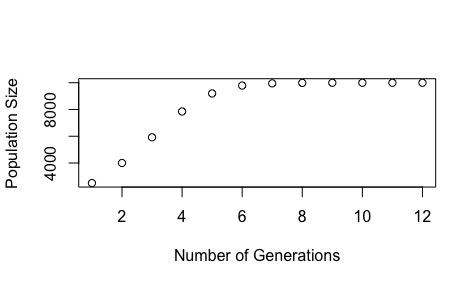

# Lab 8 Markdown
## This markdown will explain the script that I wrote for Lab 8 on 8 March 19 (Happy International Women's Day!)

## The goals
* Write a function that returns population abundance over a number of generations
    * Function arguments: r (the intrinsic growth rate), K (the carrying capacity), the total number of generations (g), and the initial population size (n).
* Edit that function such that it plots abundance over time.
* Finally, using a set of test arguments, write a csv of the resultant data from the function.

See assignment here: [Lab 8 Instructions](https://github.com/flaxmans/CompBio_on_git/blob/master/Labs/Lab08/Lab08_documentation_and_metadata.md)

## The model
Population abundance over time is modelledby a discrete-time logistic growth equation:

> n[t] = n[t-1] + ( r * n[t-1] * (K - n[t-1])/K )

where n[t] is the abundance of the population at time t, n[t – 1] is the abundance of the population in the previous time step, r is the intrinsic growth rate of the population, and K is the environmental carrying capacity for the population.
 
 ## The code
 ### I was first assigned the task of writing a function that returns population abundances and the generations over which these abundances were found.
 
 Code Notes:
 * The code below documents my function, excluding comments.
 * The function requires the four arguments mentioned above.
 * It writes two vectors that allow for the output of a single object containing both time and abundance.
 * The abundance vector is populated by the for loop, which is the discrete-time logistic growth equation listed above.

  ```
 logit_grow <- function(r, K, g, n) {
 generations <- 1:g
 abundance <- rep(0, g)
 abundance[1] <- n
 for (t in 2:g) {
 abundance[t] <- abundance[t - 1] + (r * abundance[t - 1] * (K - abundance[t - 1])/K )
 }
 time_pop <- cbind(generations, abundance)
 return(time_pop)
 }
 ```
 
 ### Next, I was assigned to produce a plot within the function that displayed population size over time.
 Code Notes: The only addition made was that of adding a plot function within the function.

```
logit_grow_plot <- function(r, K, g, n) {
generations <- 1:g
abundance <- rep(0, g)
abundance[1] <- n
for (t in 2:g) {
abundance[t] <- abundance[t - 1] + (r * abundance[t - 1] * (K - abundance[t - 1])/K )
}
plot(x = generations,y = abundance, type = "p", pch = 21, xlab = "Number of Generations", ylab = "Population Size")
time_pop <- cbind(generations, abundance)
return(time_pop)
}
```

### To demonstrate that the function works, I used the following test arguments:
> r (intrinsic growth rate): 0.8

> K (carrying capacity): 10000

> g (generations): 12

> n (initial population size): 2500

```
logit_grow_plot(r = 0.8, K = 10000, g = 12, n = 2500)
```
### This demonstration yielded the following plot and numerical output:




#### Numerical output:
```
generations abundance
[1,]           1  2500.000
[2,]           2  4000.000
[3,]           3  5920.000
[4,]           4  7852.288
[5,]           5  9201.444
[6,]           6  9789.274
[7,]           7  9954.302
[8,]           8  9990.693
[9,]           9  9998.132
[10,]          10  9999.626
[11,]          11  9999.925
[12,]          12  9999.985
```

### Finally, I was assigned to write the numerical output to a data file.

Code Notes: I first assigned the function output to make it easier to use the write.csv function.
```
output_logit_grow <- logit_grow(r = 0.8, K = 10000, g = 12, n = 2500)
```

The output was then written to a csv.
```
write.csv(x = output_logit_grow, file = "Abundance_Gen.csv", row.names = F)
```

To view the R script in its entirety: [Lab 8 R Script](https://github.com/lbrigham/CompBioLabsAndHW/blob/master/Labs/Lab8/Brigham_Lab8.R)


